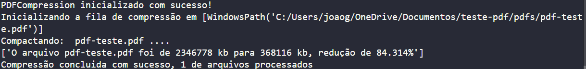
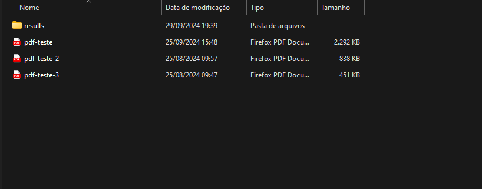
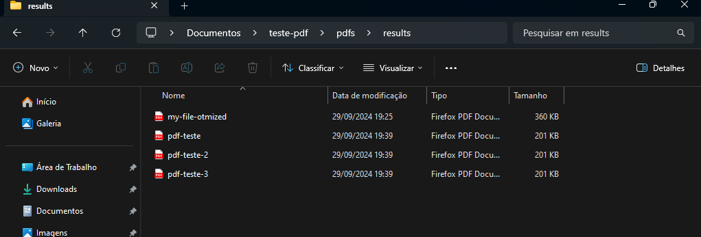

# Projeto de Compressão de PDF

Este repositório contém um projeto para compressão de arquivos PDF, visando reduzir o tamanho dos arquivos sem comprometer a qualidade do conteúdo. O objetivo é comprimir de maneira profunda, rápida e gratuita.

## Funcionalidades

- Compressão de arquivos PDF.
- Opções de configuração para diferentes níveis de compressão.
- Suporte a multiplas compressões de uma vez.

## Tecnologias Utilizadas

- Python
- Bibliotecas:
  - `Aspose` Manipulação de páginas e imagens do pdf.

   - `Aspose` Testes funcionais com pytest.

## Pré-requisitos

Antes de começar, você precisará ter o Python instalado em sua máquina. Você pode baixá-lo [aqui](https://www.python.org/downloads/).

### Instalação das Dependências

Clone este repositório e instale as dependências necessárias:

```bash
git clone https://github.com/seu_usuario/seu_repositorio.git
cd compress-pdf
pip install -r requirements.txt

```
Após instalar as dependecias, você pode já pode começar a comprimir seus pdfs, para isso siga os exemplos abaixo:


```bash
from .main import PDFCompression
from pathlib import Path

my_path = Path(__file__).parent.joinpath('pdfs')
my_file = my_path / 'pdf-generico.pdf'

with PDFCompression() as compressor:
    compressor.build(  #make compress with params
        file=my_file,
        quality=30,
        name='my-file-otmized',
        dir_to_save=my_path / 'results',
        max_width=1500, 
        max_heigth=1500
    )
    print(compressor.get_compartives) # get comparatives params

```
Com o compressor instanciado, você pode passar:
 - o arquivo e a qualidade das imagens da página do pdf (de 1 a 100)
 - o nome e o diretório em que será salvo.
 - e setar um máximo  de largura e altura das imagens.

Ouput do build:



PDF original antes:  


PDF depois: 


Para fazer o build de arquivos em fila (de uma só vez), a lógica é a mesma, basta usar o método build_all e passar o diretório onde se encontra os arquivos. Não se preocupe, o compressor irá pegar apenas os arquivos pdf.


```bash
with PDFCompression() as compressor:
    compressor.build_all(  #build_all take all pdf files
        files_dir=my_path,
        quality_per_image=30,
        dir_to_save=my_path / 'results',
        max_width=1500, 
        max_heigth=1500
    )
    print(compressor.get_compartives) # get comparatives params
```


com o build all, o compressor pega os 3 pdfs e salva em /results também.



Por enquanto ainda não vou publicar como pacote, porém ainda vou fazer um app web que possa servir o builder para comprimir vários pdfs em filas e de graça, diferentemente dos outros como Adobe, Smallpdf que além de não conseguir comprimir para tamanho abaixo de 200/100 kb, são pagos e ainda é necessário comprimir 1 por vez.

